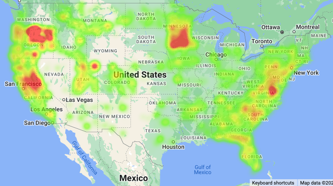
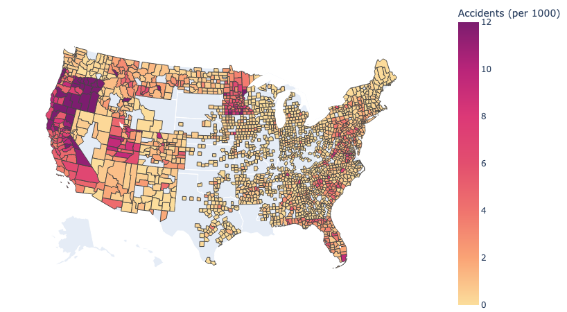
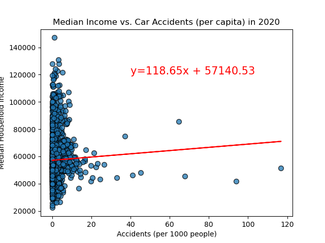
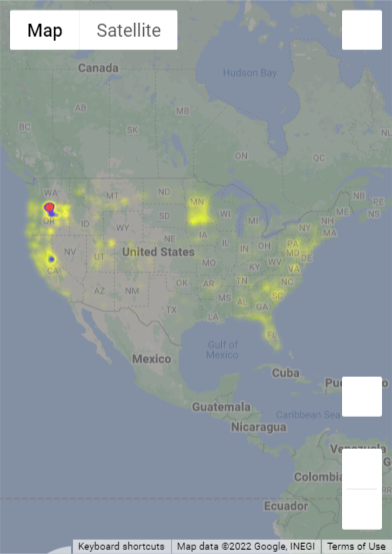
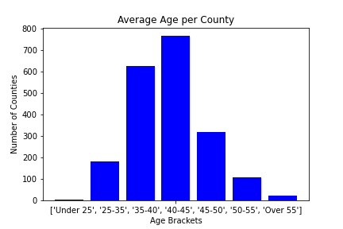

# Team9Project1Py
Jack Miller, Madina Zhaksylyk, Juan Marin, Glen Dagger

 

# Project Description

This project analyzes car accident data from the United States in 2020 and 2021 in an attempt to identify possible relationships with various factors. The data used was primarily contained within a csv file found on Kaggle called ["US Accidents (2016-2021)](https://www.kaggle.com/datasets/sobhanmoosavi/us-accidents), as well as API calls to the [Census](https://www.census.gov/data/developers/data-sets.html) and [Gmaps]() APIs. 

The most recent census data was from 2020, so all questions requiring data from the census (population, income, and age) were explored using the 2020 car accident data.

Due to missing information in the dataset that was discovered later (including unrealistically low accident counts during the summer months), questions concerning weather and time were explored using the 2021 car accident data.

The following areas were explored and compared with the relative frequency of car accidents by location across the United States:

1. Median Income by County - 2020
2. Median Age by County - 2020
3. Time of Year (Including Holidays) - 2021
4. Weather - 2021

---

## Median Income by County
*Does median income within a particular county correlate with the number of car accidents?*

In order to analyze the accident data by county, we read the csv file into a Jupyter Notebook using Pandas and filtered out columns with unnecessary data. We selected all rows with the year 2020 and grouped the data by “County” and “State” to count the number of accidents in each county. We then needed to find the population and median income of each county, which we accomplished through API calls to the Census.gov site. The number of accidents per 1000 people was calculated by dividing the accident count of each county by its population and multiplying that value by 1000. Once that was done, we were able to create a heat map that shows areas with a higher number of accidents per capita by county. 

 

Interestingly, the regions that showed the highest intensity were southern/central Minnesota (triangle from Twin Cities down to Rochester and west almost to Sioux Falls), central/eastern California (in the vicinity of Sacramento), northern Oregon (east of Portland), and to a lesser extent, in Virginia (greater Richmond area).

There does not appear to be a relationship between these areas as they each vary significantly in region and population, though they are all in the general vicinity of cities with similar metro population sizes  (metro populations of between 1 and 4 million ). 

 

In order to get a more accurate understanding of the dataset in terms of accidents in each county per capita, we used Plotly to create a chloropleth map to display the United States map with county boundaries shown. Each county was then coded on a gradient scale according to the number of accidents per 1000 people. This map showed similar patterns as the heat map, as far as areas in the United States with higher per capita accident rates. 
It also showed however that there are a significant number of counties that either had no accidents all year or were not represented within the data source (particularly in the middle of the country and most of Texas/Louisiana). We do not have a sufficient explanation for these gaps in data.

 

In order to answer the research question, we created a scatter plot of car accidents per 1000 people vs. the county median household income in 2020. We calculated the linear regression and r value, and found no correlation between the median household income of a county and its accidents per capita (r value of 0.04). This shows no evidence of a relationship between the amount of wealth in a county and its relative frequency of car accidents.

___
## Median Age by County
*Does median age within a particular county correlate with the number of car accidents?*

For looking if age had any impact, the median age per county was used as multiplier to the number of accidents per 1000 people in each county. A heat map was created to see how it visually changed compared to the heat map the shows the number of accidents per 1000 people. The idea behind using median age as a multiplier was that if the median age was would exaggerate higher aged counties, potentially changing the visualization. The results smoothed out the heatmap showing only counties in Oregon and California reached the higher ends of the range for this data, with the majority of counties falling into lower percentiles.

For further context on the multiplier, a bar graph was developed to look at the number of counties in each age bracket. Approximately 80% of the counties fell into age brackets between 35 - 50, which included 3 of the 7 total age brackets.

___
## Time of Day/Year

*Is the time of year related to the amount of car accidents in the United States?*

In order to answer this question we started with the Kaggle car accident data from 2016-2021. First, we had to choose what year to use for this question. Originally, we tried using 2020 to match the same year that was for the income and age questions. But after further investigation, we noticed that 2020 data had some limitations for car accidents for certain months, specifically the summer months and fourth of July had no car accidents. Thus, we chose 2021 to answer this specific question. 

In order to get the dataset ready for the analysis we added a months column that would take into account the month of the accident. To create this column, only the two numbers that represented the month  from the “start time” column were taken out in order to create this new column. Afterwards, I was able to create a line graph that represented the trend of car accidents throughout the year according to months. 

 

The graph showed that the spring time months see the least amount of accidents and then they steadily keep rising since May and peak during the winter months. The peak in winter months could maybe be explained by the winter weather conditions that make driving harder for people. This made us think of the next question, if certain holidays have more car accidents than others.

In order to answer this question we had to create buckets for each holiday. Any accident that occurred on 12/24 was Christmas, any accident that occurred on 10/31 was halloween, and etc. So after those buckets were created, we created a new dataframe that only had car accidents by holidays and that was then graphs into a bar graph in order to accurately compare the results between the 6 holidays. 

 

This graph was able to show us that Christmas had the most amount of car accidents compared to all the other holidays. It doubled the amount of car accidents for all the other holidays. Therefore, US citizens should be most careful when driving during winter months and especially during Christmas since the highest number of car accidents happen during those time periods. 
___
## Weather
